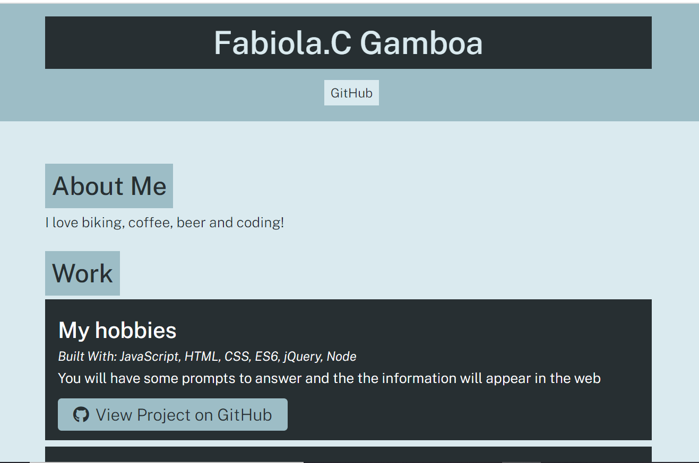

 
  # Portfolio Generator

  # Table of Contents
  _________________________________

[Description](#Description)

[Installations](#Installations)

[Usage](#Usage)

[Credits](#Credits)

[License](#License)

[Test](#Test)

[Questions](#Questions)
 

  # Description
   You need to enter into the terminal 'node app.js' and then will appeard a serie of prompts related to your work, that then it will create an html file with all the information provided by the user

  # Installation
    inquirer

  # Usage
    node index.js 

  # Credits
  none

  # License
  
  
  # Test
  none

  # Questions
  _________________________________

  ## If you have any further questions about this project, you can always contact me here:(Click Enter)

  ## Autor
  Fabiola C. Gamboa

  ## [Github](https://github.com/Fabskickass)
  

  ## [Email](fabiscg79@gmail.com)

  

  
